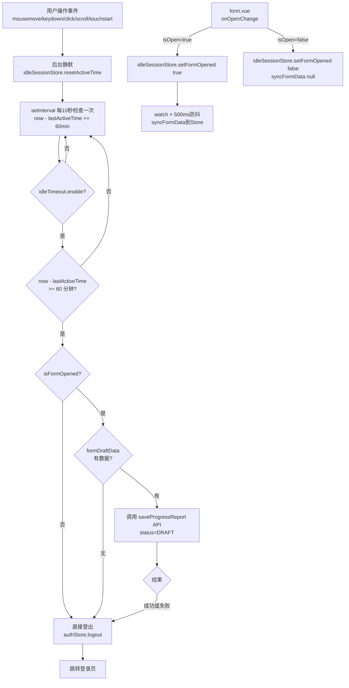

# 用户 60 分钟无操作自动退出并保存草稿

## 需求确认

- 超时时间：**可配置**（默认 60 分钟）
- 自动保存触发时机：**仅在退出前保存一次**
- 多页面处理：**只保存当前正在操作的填报页面**
- 检查间隔：**10 秒**（从 1 秒放宽）
- 数据同步：**watch + 500ms 防抖**

## 核心设计原则

**用户完全无感知**：除了超时退出本身外，不在正常使用时展示任何 UI。

## 架构概览

```
用户正常使用 → 每次操作后延计时器（静默） → 60分钟无操作
    → 如果填报表单打开：从 Store 读取 formData + values
    → 调用 saveProgressReport API 静默保存（status=DRAFT）
    → 执行登出 → 跳转登录页
```

## 已知问题与解决方案

### 问题 1：Form 组件有两层 Modal 嵌套

- **外层**（`hospital.vue`/`HospitalDashboard.vue`）：`[FormModal, formModalApi]` 管理 Form 组件的挂载/卸载
- **内层**（`form.vue`）：`[Modal, modalApi]` 管理填报内容弹窗的显示/隐藏

**解决方案**：在 `form.vue` 的 `onOpenChange` 中设置 `isFormOpened = true`，无需关注外层。

### 问题 2：`useVbenModal` 没有暴露 `isOpen` Getter

**解决方案**：使用 `onOpenChange` 回调函数，在回调中更新 Store。

### 问题 3：Dashboard 和 List 页面共用 Form 组件

两个入口使用**同一个 Form 组件**，但各自有独立的 `formModalApi`。

**解决方案**：`isFormOpened` 存储在全局 Store 中，以最后一次状态为准。IdleTimeout 只需要知道"有没有表单打开"，不需要区分是哪个入口打开的。

### 问题 4：数据同步的实时性

`handleSaveDraft` 涉及多步骤数据收集，不能简单用 watch 替代。

**解决方案**：使用 `watch` + `useDebounceFn`（500ms 防抖），保证数据足够新且不过于频繁。

---

## 实现步骤

### 第一步：新建 IdleSession Store

**新建文件：** `web-ui/packages/stores/src/modules/idleSession.ts`

```typescript
interface FormDraftData {
  id?: number;
  reportYear?: number;
  reportBatch?: number;
  reportStatus: string;
  values: Array<{
    indicatorId: number;
    indicatorCode: string;
    valueType: number;
    value: any;
  }>;
}

interface IdleSessionState {
  /** 最后操作时间（毫秒时间戳） */
  lastActiveTime: number;
  /** 登录时间（毫秒时间戳） */
  loginTime: number;
  /** 填报表单是否打开 */
  isFormOpened: boolean;
  /** 当前表单草稿数据 */
  formDraftData: FormDraftData | null;
}

export const useIdleSessionStore = defineStore('idle-session', {
  state: (): IdleSessionState => ({
    lastActiveTime: Date.now(),
    loginTime: Date.now(),
    isFormOpened: false,
    formDraftData: null,
  }),

  actions: {
    resetActiveTime() {
      this.lastActiveTime = Date.now();
    },

    setLoginTime() {
      this.loginTime = Date.now();
      this.lastActiveTime = Date.now();
    },

    setFormOpened(opened: boolean) {
      this.isFormOpened = opened;
      // 关闭时清空草稿数据
      if (!opened) {
        this.formDraftData = null;
      }
    },

    syncFormData(data: FormDraftData | null) {
      this.formDraftData = data;
    },
  },
});
```

### 第二步：修改 Store 导出

**修改文件：** `web-ui/packages/stores/src/modules/index.ts`

```typescript
export * from './access';
export * from './dict';
export * from './idleSession';  // 新增
export * from './tabbar';
export * from './timezone';
export * from './user';
```

### 第三步：修改 preferences 配置

**修改文件：** `web-ui/packages/@core/preferences/src/config.ts`

```typescript
idleTimeout: {
  enable: true,           // 是否启用，默认开启
  timeout: 60 * 60 * 1000, // 超时时间，默认 60 分钟
  autoSaveDraft: true,     // 超时前是否自动保存草稿
},
```

### 第四步：修改 AuthStore 登录时初始化 loginTime

**修改文件：** `web-ui/apps/web-antd/src/store/auth.ts`

在登录成功后调用 `idleSessionStore.setLoginTime()`。

### 第五步：修改 form.vue — 同步数据到 Store

**修改文件：** `web-ui/apps/web-antd/src/views/declare/progress-report/modules/form.vue`

#### 5.1 添加 Store 引用和 debounce 工具

```typescript
import { useIdleSessionStore } from '#/store';
import { useDebounceFn } from '@vben/hooks';

const idleSessionStore = useIdleSessionStore();
```

#### 5.2 在 `onOpenChange` 中设置 `isFormOpened`

```typescript
async onOpenChange(isOpen: boolean) {
  // 立即设置（不等待后续异步操作）
  idleSessionStore.setFormOpened(isOpen);

  if (!isOpen) {
    // 关闭时清空
    idleSessionStore.syncFormData(null);
    formData.value = {
      id: undefined,
      hospitalId: 0,
      projectType: undefined,
      reportYear: undefined,
      reportBatch: undefined,
      reportStatus: undefined,
      projectTypeShortName: undefined,
      windowStart: undefined,
      windowEnd: undefined,
      reportUserName: undefined,
    };
    return;
  }
  // ... 其余原有逻辑保持不变 ...
}
```

#### 5.3 添加数据同步 watch（500ms 防抖）

在 `onMounted` 或 setup 末尾添加：

```typescript
/** 防抖同步表单数据到 Store */
const debouncedSyncFormData = useDebounceFn(() => {
  if (!formData.value?.id) return;

  const rawValues = indicatorTableRef.value?.getAllIndicatorValues?.() || [];
  const values = rawValues.map((item: any) => {
    const base: any = {
      indicatorId: item.indicatorId,
      indicatorCode: item.indicatorCode,
      valueType: item.valueType,
      value: extractValue(item),
    };
    if (item.valueType === 8) {
      base.value = undefined;
      base.valueDateStart = item.valueDateStart;
      base.valueDateEnd = item.valueDateEnd;
    }
    return base;
  });

  idleSessionStore.syncFormData({
    id: formData.value.id,
    reportYear: formData.value.reportYear,
    reportBatch: formData.value.reportBatch,
    reportStatus: 'DRAFT',
    values,
  });
}, 500);

// watch formData 和指标值变化
watch(
  [formData, () => indicatorTableRef.value?.getAllIndicatorValues?.()],
  () => {
    if (formData.value?.id && idleSessionStore.isFormOpened) {
      debouncedSyncFormData();
    }
  },
  { deep: true }
);
```

### 第六步：新建 IdleTimeout 组件

**新建文件：** `web-ui/packages/effects/layouts/src/widgets/idle-timeout/IdleTimeout.vue`

```typescript
<script setup lang="ts">
import { computed, onMounted, onUnmounted } from 'vue';
import { storeToRefs } from 'pinia';

import { useIdleSessionStore, useAccessStore } from '@vben/stores';
import { preferences } from '@vben/preferences';

import { saveProgressReport } from '#/api/declare/progress-report';
import { useAuthStore } from '#/store';

const ACTIVITY_EVENTS = ['mousemove', 'keydown', 'click', 'scroll', 'touchstart'];
const CHECK_INTERVAL = 10 * 1000; // 10 秒检查一次

const idleSessionStore = useIdleSessionStore();
const authStore = useAuthStore();
const idleTimeout = preferences.idleTimeout;
const { isFormOpened, formDraftData } = storeToRefs(idleSessionStore);

let intervalId: ReturnType<typeof setInterval> | null = null;

/** 重置活跃时间 */
function handleActivity() {
  if (!idleTimeout.enable) return;
  idleSessionStore.resetActiveTime();
}

/** 检查是否超时 */
function checkIdle() {
  if (!idleTimeout.enable) return;
  const elapsed = Date.now() - idleSessionStore.lastActiveTime;
  if (elapsed >= idleTimeout.timeout) {
    handleTimeout();
  }
}

/** 超时处理 */
async function handleTimeout() {
  if (intervalId) {
    clearInterval(intervalId);
    intervalId = null;
  }

  // 如果表单打开且有数据，尝试保存草稿
  if (isFormOpened.value && formDraftData.value && idleTimeout.autoSaveDraft) {
    try {
      await saveProgressReport({
        ...formDraftData.value,
        reportStatus: 'DRAFT',
      });
    } catch (e) {
      // 保存失败也继续登出
      console.warn('Idle timeout: draft save failed', e);
    }
  }

  // 执行登出
  await authStore.logout();
}

onMounted(() => {
  if (!idleTimeout.enable) return;

  // 注册事件监听（静默，无 UI）
  ACTIVITY_EVENTS.forEach((event) => {
    document.addEventListener(event, handleActivity, { passive: true });
  });

  // 启动定时检查（10 秒一次）
  intervalId = setInterval(checkIdle, CHECK_INTERVAL);
});

onUnmounted(() => {
  ACTIVITY_EVENTS.forEach((event) => {
    document.removeEventListener(event, handleActivity);
  });
  if (intervalId) {
    clearInterval(intervalId);
  }
});
</script>

<template>
  <!-- 无渲染内容，纯逻辑组件 -->
</template>
```

### 第七步：挂载到 Layout

**修改文件：** `web-ui/apps/web-antd/src/layouts/basic.vue`

```vue
<script setup>
import IdleTimeout from '@vben/layouts/src/widgets/idle-timeout/IdleTimeout.vue';
</script>

<template>
  <BasicLayout @clear-preferences-and-logout="handleLogout">
    <!-- 仅在已登录状态渲染 -->
    <IdleTimeout />
    <!-- 其余 layout 内容保持不变 -->
  </BasicLayout>
</template>
```

### 第八步：导出组件

**修改文件：** `web-ui/packages/effects/layouts/src/widgets/index.ts`

```typescript
export { default as IdleTimeout } from './idle-timeout/IdleTimeout.vue';
export * from './check-updates';
// ... 其余保持不变
```

---

## 关键文件清单

| 步骤 | 文件路径 | 操作 |
|------|----------|------|
| 1 | `web-ui/packages/stores/src/modules/idleSession.ts` | **新建** |
| 2 | `web-ui/packages/stores/src/modules/index.ts` | 修改 |
| 3 | `web-ui/packages/@core/preferences/src/config.ts` | 修改 |
| 4 | `web-ui/apps/web-antd/src/store/auth.ts` | 修改 |
| 5 | `web-ui/apps/web-antd/src/views/declare/progress-report/modules/form.vue` | 修改 |
| 6 | `web-ui/packages/effects/layouts/src/widgets/idle-timeout/IdleTimeout.vue` | **新建** |
| 7 | `web-ui/packages/effects/layouts/src/widgets/index.ts` | 修改 |
| 8 | `web-ui/apps/web-antd/src/layouts/basic.vue` | 修改 |

---

## 数据流图



---

## 设计要点

1. **静默监控**：用户操作只更新 Store 中的 `lastActiveTime`，无任何 DOM 操作或 UI 反馈
2. **性能友好**：`passive: true` + `setInterval(10000)`，几乎零开销
3. **容错性强**：草稿保存失败也不影响登出流程
4. **可配置开关**：`preferences.idleTimeout.enable` 可快速关闭功能
5. **数据新鲜度**：500ms 防抖保证 Store 中数据足够新，10 秒检查间隔足够宽松