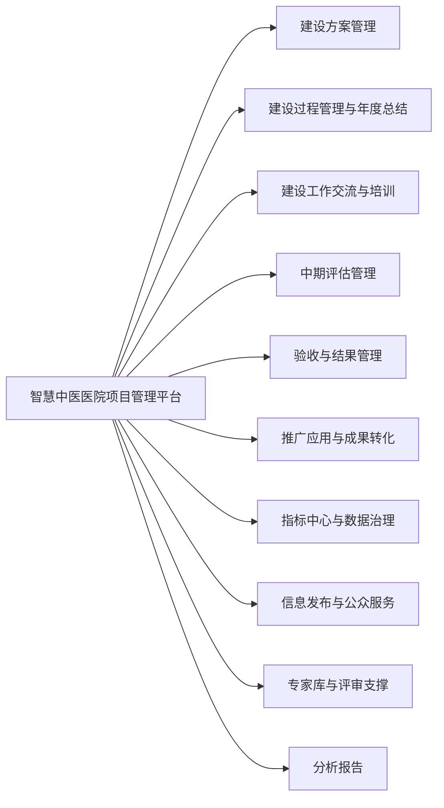
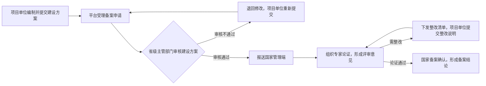

# 智慧中医医院试点项目过程管理平台项目需求分析

**编制单位**：国家中医药管理局监测统计中心

**编制日期**：2025 年 12 月 25 日

## 目录


1. [引言](#1-引言)

   1.1 [编写目的](#11-编写目的)

   1.2 [项目背景](#12-项目背景)

   1.3 [使用范围](#13-使用范围)

   1.4 [参考资料](#14-参考资料)

   1.5 [非功能需求](#15-非功能需求)

2. [总体架构](#2-总体架构)

   2.1 [总体功能架构图](#21-总体功能架构图)

3. [业务功能](#3-业务功能)

   3.1 [建设方案备案管理](#31-建设方案备案管理)

   3.1.1 [备案申报与模板管理](#311-备案申报与模板管理)

   3.1.2 [省级审核与汇交](#312-省级审核与汇交)

   3.1.3 [专家论证与备案归档](#313-专家论证与备案归档)

   3.2 [建设过程管理与年度总结](#32-建设过程管理与年度总结)

   3.2.1 [管理指标体系与填报机制](#321-管理指标体系与填报机制)

   3.2.2 [进度看板与预警](#322-进度看板与预警)

   3.2.3 [年度总结组织与成果沉淀](#323-年度总结组织与成果沉淀)

   3.2.4 [综合监管驾驶舱](#324-综合监管驾驶舱)

   3.3 [建设工作交流与培训](#33-建设工作交流与培训)

   3.3.1 [交流活动管理](#331-交流活动管理)

   3.3.2 [经验库与工具包](#332-经验库与工具包)

   3.3.3 [案例展示与系统演示专区](#333-案例展示与系统演示专区)

   3.4 [中期评估管理](#34-中期评估管理)

   3.4.1 [自评报告在线填报与证据链绑定](#341-自评报告在线填报与证据链绑定)

   3.4.2 [专家评估工作台](#342-专家评估工作台)

   3.4.3 [评估反馈与整改跟踪闭环](#343-评估反馈与整改跟踪闭环)

   3.5 [验收与结果管理](#35-验收与结果管理)

   3.5.1 [验收申请与材料清单管理](#351-验收申请与材料清单管理)

   3.5.2 [验收组织、评分规则与结论归档](#352-验收组织评分规则与结论归档)

   3.5.3 [验收结果通报与资格管理](#353-验收结果通报与资格管理)

   3.6 [推广应用与成果转化](#36-推广应用与成果转化)

   3.6.1 [经验成果遴选与转化](#361-经验成果遴选与转化)

   3.6.2 [行业推广与复制路径](#362-行业推广与复制路径)

   3.7 [指标中心与数据治理](#37-指标中心与数据治理)

   3.7.1 [指标分类体系](#371-指标分类体系)

   3.7.2 [指标口径库与计算规则](#372-指标口径库与计算规则)

   3.8 [信息发布与公众服务](#38-信息发布与公众服务)

   3.8.1 [政策与通知发布](#381-政策与通知发布)

   3.8.2 [项目进展与成效发布](#382-项目进展与成效发布)

   3.8.3 [典型案例专题页](#383-典型案例专题页)

   3.9 [专家库与评审支撑](#39-专家库与评审支撑)

   3.9.1 [专家库建设与遴选管理](#391-专家库建设与遴选管理)

   3.9.2 [评审任务派发与冲突回避](#392-评审任务派发与冲突回避)

   3.9.3 [评审过程留痕与质量评估](#393-评审过程留痕与质量评估)

   3.10 [分析报告](#310-分析报告)

   3.10.1 [院级分析报告](#3101-院级分析报告)

   3.10.2 [省级分析报告](#3102-省级分析报告)

   3.10.3 [区域级分析报告](#3103-区域级分析报告)

   3.10.4 [国家级分析报告](#3104-国家级分析报告)

   3.11 [业务流程与管理机制设计](#311-业务流程与管理机制设计)

   3.11.1 [备案流程](#3111-备案流程)

   3.11.2 [中期评估流程](#3112-中期评估流程)

   3.11.3 [交流流程](#3113-交流流程)

   3.11.4 [验收流程](#3114-验收流程)

   3.11.5 [转化流程](#3115-转化流程)


***

## 1 引言

### 1.1 编写目的

编写此文档的目的是进一步定制软件开发的细节问题，希望能使本软件开发工作更具体。是为使用户、软件开发者及分析人员对该软件的初始规定有一个共同的理解，它说明了本产品的各项功能需求、非功能需求，明确标识各功能的实现过程，阐述适用背景及范围，提供客户解决问题或达到目标所需的条件或权能，提供一个度量和遵循的基准。

本文档的读者为系统涉及用户、监理方、实施方、开发工程师、测试工程师，项目经理。

### 1.2 项目背景

为贯彻落实《"十四五" 中医药信息化发展规划》《关于促进数字中医药发展的若干意见》等政策要求，按照国家中医药管理局 2024 年第 22 次局长会议部署，中心需承担智慧中医医院试点项目申报遴选、过程管理、评估验收、经验推广等具体工作。当前试点项目涉及全国多个省份、不同类型中医医院，传统线下管理模式存在信息传递滞后、流程协同低效、数据统计分散等问题，亟需搭建统一的数字化管理平台，支撑项目全流程规范化管理，保障试点示范引领作用有效发挥。

局监测统计中心依托信息化建设处设立项目管理办公室，负责组建项目专家指导组、建立项目监管平台、开展建设方案备案、中期评估与指导、工作交流、项目验收、推广应用等管理工作。中心有关处室协助信息化建设处做好平台建设。

智慧中医医院项目管理平台主要功能包括：建设方案备案管理、建设过程管理与年度总结、建设工作交流与培训、中期评估管理、验收与结果管理、推广应用与成果转化、指标中心与数据治理、信息发布与公众服务、专家库与评审支撑、分析报告等模块。

### 1.3 使用范围

智慧中医医院项目管理平台的用户为局监测统计中心、省级中医药主管部门、项目建设单位及相关人员。

### 1.4 参考资料


1. 《智慧中医医院试点项目建设指导意见》

2. 《国家中医药管理局综合司关于开展智慧中医医院试点项目建设单位遴选申报工作的通知》国中医药综规财函 \[2025] 1 号

### 1.5 非功能需求


1. **安全要求**：符合《中华人民共和国网络安全法》《中华人民共和国数据安全法》要求，落实数据分类分级保护，具备防泄露、防篡改、防攻击能力。

2. **易用要求**：界面设计简洁直观，操作流程清晰，支持电脑端、移动端适配，降低用户学习成本。

3. **国产化**：应用软件核心技术自主可控，能够全面兼容适配主流国产软硬件环境，可以在国产的 CPU 芯片、操作系统、中间件、数据库等国产化软硬件环境上稳定运行。

4. **性能要求**：系统处理能力要考虑系统能承载的最大并发用户数，包括局监测统计中心、省级中医药主管部门、项目建设单位及相关人员。统一身份认证能力应支持不少于 1000 名在线用户。数据查询分析和业务处理要求速度快、反应及时，在静态页面并发 1000 用户时业务操作响应时间小于 3 秒（不考虑带宽限制）。


***

## 2 总体架构

### 2.1 总体功能架构图


   <!-- 
   Mermaid 流程图如果在预览或部分 Markdown 编辑器中无法渲染，通常原因包括：
   1. 当前编辑器或预览工具不支持 mermaid 语法，需要在支持 mermaid 的平台（如 GitHub、Gitee、Typora 或 Obsidian 等）查看，或者使用 VSCode 的插件（如 Markdown Preview Enhanced）。
   2. 语法缩进错误。建议紧贴左侧书写，不要在代码块内容前多加空格。
   3. 代码块语法异常或不被解析。

   可尝试如下方式提高兼容性（去除多余缩进，贴齐左侧）：
   -->



智慧中医医院项目管理平台整体架构围绕项目全生命周期管理设计，核心模块分为三大类：


1. **核心管理模块**：建设方案备案管理、建设过程管理与年度总结、中期评估管理、验收与结果管理、推广应用与成果转化，按项目实施节奏顺序组织运行，形成全流程闭环。

2. **数据支撑模块**：指标中心与数据治理，贯穿各业务模块，为平台运行提供统一的数据支撑。

3. **业务支撑模块**：建设工作交流与培训、信息发布与公众服务、专家库与评审支撑、分析报告，作为业务运行的重要补充，与核心管理模块协同配合。

平台整体形成**以项目为主线、以指标为纽带、以证据为支撑**的功能体系，各模块之间通过统一的流程和数据规则进行衔接，前一环节形成的成果和数据，作为后一环节的重要依据，避免信息割裂和重复录入，确保管理链条连续完整。


***

## 3 业务功能

### 3.1 建设方案备案管理

#### 3.1.1 备案申报与模板管理

平台在备案申报环节提供统一、规范的模板管理能力，作为项目启动和后续管理的基础入口。通过标准化建设方案提纲，明确项目建设目标、实施内容、技术路线、进度安排和预期成效，引导项目单位按国家统一要求编制方案，减少理解偏差和反复修改。

在附件管理方面，平台对备案所需的各类支撑材料进行统一归集和结构化管理，明确必填材料清单和提交要求，支持附件与对应章节和指标进行关联，避免材料零散堆积，提高审核和评审效率。

同时，平台支持方案和材料的版本管理，完整保留每次提交、修改和确认记录，清晰呈现方案调整过程和变化内容，确保备案结果可追溯，为后续过程管理、评估和验收提供权威依据。

#### 3.1.2 省级审核与汇交

平台为省级中医药主管部门提供统一的审核与汇交机制，规范建设方案在省级层面的受理、审查和上报流程。省级部门可在平台内对项目单位提交的备案方案进行集中审核，围绕建设内容、实施路径和指标设置等关键要点提出审查意见，确保方案符合国家要求和区域实际。

#### 3.1.3 专家论证与备案归档

国家层面组织专家开展论证评审，平台支持专家论证任务派发、论证意见归集，对通过论证的项目完成备案确认，形成最终备案档案。备案结果作为项目后续管理、评估和验收的依据，贯穿项目实施全过程。

### 3.2 建设过程管理与年度总结

#### 3.2.1 管理指标体系与填报机制

指标填报以统一口径为基础，按照明确的指标定义、统计方式和数据来源开展，确保不同项目在同一标准下填报和比较。平台支持按指标逐项填报，并与过程材料和支撑证明进行关联，提高填报数据的准确性和可核验性。

在时间维度上，平台根据《智慧中医医院试点项目调度管理指标调查表》填报周期要求，形成半年报、年报。通过 "按方案设指标、按指标定填报、按时间做管理" 的方式，使项目进展能够持续反映、动态掌握，为过程管理和风险预警提供支撑。

#### 3.2.2 进度看板与预警

平台通过统一的进度看板，对项目整体推进情况进行集中展示，支持按项目、地区和阶段查看关键任务和指标完成情况，使各级管理人员能够直观掌握项目进展状态。看板以备案方案和管理指标为依据，突出当前进度与计划目标之间的差异，避免仅凭文字汇报判断进度。

当项目出现进度滞后、指标异常或关键任务未按期完成等情况时，平台自动触发预警提示，明确风险点和影响范围，提醒相关责任主体及时关注和处理。预警信息与具体指标和任务绑定，减少模糊判断空间。

针对预警事项，平台支持整改任务的下发、跟踪和反馈，形成从发现问题、落实整改到结果确认的闭环管理，确保风险处置有记录、整改落实有结果，为后续评估和验收提供依据。

#### 3.2.3 年度总结组织与成果沉淀

平台支撑年度总结工作的统一组织和规范开展，围绕项目年度建设目标和实施情况，引导项目单位按统一要求梳理年度进展、阶段成果和存在问题，避免临近评估时集中补材料的情况。

年度总结内容与备案方案和管理指标进行关联，重点反映任务落实情况和实际成效，形成结构化成果记录。通过平台集中汇总和分析，为国家和省级层面全面掌握年度建设情况提供依据。

同时，平台对年度总结中形成的有效做法、典型成果和共性问题进行归集和整理，作为后续交流分享、评估验收和案例推广的重要基础，实现成果的持续沉淀和复用。

#### 3.2.4 综合监管驾驶舱

构建国家智慧中医医院建设监管顶层决策可视化中枢，以 "宏观把控、中观穿透、微观溯源" 为核心，实现 "一眼观全局、一屏管全程、一键促协同"。

以项目备案、实施、评估、验收、推广全链条闭环管理等方式，展示智慧中医医院建设的总体布局，可视化呈现各省份项目分布、建设阶段、核心指标完成情况；点击可分层下钻查看各级项目清单及关键进展，直观反映全国项目布局与推进均衡性。

既满足国家层面统筹管理、政策落地监测、风险预警处置的决策需求，也为省级中医药主管部门、项目单位提供分级可视化支撑，为智慧中医医院建设提供强有力的数字化管理支撑。分医院类型、分医院等级、分地域、分指标呈现，能根据不同的分析指标要求，自动生成一份分析报告。

### 3.3 建设工作交流与培训

#### 3.3.1 交流活动管理

平台统一承载国家和省级层面组织的各类交流活动管理，覆盖项目推进会、专题研讨、系统演示和业务培训等多种形式，为项目实施过程中的沟通协同提供稳定支撑。通过线上发布活动信息、组织报名和通知安排，规范交流活动流程，提升组织效率。

活动过程中形成的会议材料、演示文档、培训内容和交流成果，统一在平台归集和留存，支持分类管理和回溯查看，方便不同地区和项目单位参考借鉴。通过持续开展交流与培训，推动经验共享和共性问题的集中讨论，为项目实施提供实践指导。

同时，平台对交流活动的开展情况进行记录和统计，形成可查询的活动台账，为后续项目评估、成果总结和典型案例提炼提供基础支撑。

#### 3.3.2 经验库与工具包

平台建设统一的经验库与工具包，对项目实施过程中形成的成熟做法和有效经验进行系统归集、整理和沉淀。通过对不同项目实践成果的梳理，将零散、个性化的经验转化为结构清晰、可理解、可借鉴的内容，降低其他单位学习和应用成本。

经验库重点汇集项目推进中的典型做法、管理思路和实施路径，形成具有参考价值的实践案例；工具包以模板、方法论和可复用清单等形式，提供可直接套用的工作参考，帮助项目单位在方案编制、过程管理和成果总结等环节提高效率和规范性。

通过持续更新和完善，经验库与工具包逐步成为支撑项目实施、交流培训和成果推广的重要基础资源，推动成熟经验在更大范围内复制应用。

#### 3.3.3 案例展示与系统演示专区

平台设置案例展示与系统演示专区，对项目实施过程中形成的典型案例和代表性成果进行集中展示。通过规范化整理案例背景、实施过程、建设成效和可借鉴要点，使项目成果呈现更加直观、清晰，便于不同地区和项目单位理解和参考。

系统演示专区重点展示成熟应用场景和实际运行效果，支持通过演示材料、操作说明等形式，直观呈现建设成果的落地情况。通过案例展示与系统演示相结合，增强成果传播的可读性和说服力，为经验交流、推广应用和后续项目实施提供有效支撑。

### 3.4 中期评估管理

#### 3.4.1 自评报告在线填报与证据链绑定

平台为项目单位提供统一的中期自评报告在线填报功能，通过规范化模板，引导项目单位围绕建设目标、实施进展、阶段成果和存在问题开展系统梳理，确保自评内容结构清晰、重点突出，避免流于概述性描述。

在自评填报过程中，平台要求自评结论与备案方案和管理指标相对应，关键内容需同步关联具体指标数据和支撑材料。通过将自评结论、指标数据和过程性材料进行绑定，形成清晰的证据链条，使自评结果有据可查、可复核。

这种方式有助于提升自评工作的严肃性和真实性，也为后续专家评估、问题研判和整改落实提供可靠依据，减少评估阶段反复补充材料的情况。

#### 3.4.2 专家评估工作台

平台为专家开展中期评估和验收评审提供统一的评估工作台，集中呈现项目备案方案、自评报告、管理指标和支撑材料，方便专家在同一环境下开展综合判断，减少资料分散带来的评审成本。

专家可在工作台内按照统一标准进行评分，并针对项目建设情况提出评估意见。平台支持将专家意见与具体指标和问题点进行关联，形成明确、可执行的整改清单，避免评审意见泛化、难以落实。

评估过程中形成的评分结果、评审意见和整改要求均在平台内留痕管理，支持后续复核和跟踪整改落实情况，为评估结论的连续性和权威性提供支撑。

#### 3.4.3 评估反馈与整改跟踪闭环

平台对专家评估形成的意见和结论进行统一反馈管理，将评估结果及时传递至项目单位，并明确需要整改的问题事项和完成要求，避免评估结论停留在文件层面。反馈内容与具体指标和评估依据保持对应，便于项目单位准确理解整改重点。

针对整改事项，平台支持整改任务的分解、责任落实和进度跟踪，项目单位可按要求提交整改说明和支撑材料，形成完整的整改记录。整改过程中的进展情况在平台内持续更新，确保整改工作有章可循。

整改完成后，平台支持对整改结果进行复核和确认，将整改情况纳入项目过程管理档案，形成从评估反馈、整改落实到结果确认的闭环管理，为后续验收和成果认定提供可靠依据。

### 3.5 验收与结果管理

#### 3.5.1 验收申请与材料清单管理

平台为项目验收提供统一的申请和材料管理机制，规范验收启动流程，避免各项目在验收阶段临时组织、标准不一。项目单位可按照平台要求在线提交验收申请，明确验收范围、完成情况和自评结论，作为组织验收工作的基础依据。

平台同步提供标准化的验收材料清单，对验收所需的报告、成果证明和支撑材料进行明确指引，并支持材料分类上传和完整性校验，减少遗漏和反复补充。验收材料与备案方案、过程指标和评估结论进行关联管理，确保验收依据清晰、来源一致。

通过统一的申请和材料清单管理，平台帮助项目单位提前做好验收准备，也为省级组织和专家开展验收工作提供结构化支撑，提高验收工作的规范性和效率。

#### 3.5.2 验收组织、评分规则与结论归档

平台统一支撑项目验收的组织实施，明确验收流程、参与角色和时间节点，保障验收工作有序开展。验收过程中，平台按照既定规则调配专家资源，集中呈现备案方案、过程数据、评估整改情况和验收材料，为验收判断提供完整依据。

验收评分采用统一、透明的规则体系，评分标准与备案方案和指标体系保持一致，避免临时调整口径。专家评分结果与具体指标和验收要点进行关联，确保评分过程有据可依、结论形成逻辑清晰。

验收完成后，平台对评分结果、专家意见和最终结论进行统一归档，形成可查询、可回溯的验收档案。通过保留完整过程记录和依据材料，为后续复核、抽查和责任认定提供支撑，增强验收结论的稳定性和权威性。

#### 3.5.3 验收结果通报与资格管理

平台对项目验收结论进行统一汇总和规范通报，明确项目是否通过验收及相关评价意见，确保验收结果表达清晰、口径一致。通报内容与验收依据和结论保持对应，避免结论模糊或理解偏差，便于各方准确掌握项目最终成效。

验收结果同步纳入项目资格管理，对通过验收的项目明确其成果认定和后续应用资格，对未通过或需限期整改的项目，标注管理状态并跟踪后续处置情况。通过将验收结果与资格状态关联管理，强化验收结论的约束力和实际效用，为后续项目管理、成果推广和政策支持提供依据。

### 3.6 推广应用与成果转化

#### 3.6.1 经验成果遴选与转化

平台围绕项目建设过程中形成的实践成果，建立规范的遴选与转化机制，对具有代表性和推广价值的经验做法进行系统梳理和评估。通过统一的遴选标准，从项目实施成效、可复制性和应用价值等方面综合判断，筛选出具备示范意义的成果。

遴选出的经验成果，按照不同类型进行分类转化：


* 成熟、稳定的做法可进一步凝练为标准规范或管理指引，为后续同类项目提供统一参考；

* 具有创新性和实践价值的路径，可总结形成创新模式，供不同地区结合实际推广应用；

* 典型项目和标志性成果，则通过案例形式进行展示，清晰呈现背景、做法和成效。

通过将经验成果由 "个案实践" 转化为 "可推广成果"，推动项目建设经验在更大范围内共享和应用，持续放大国家智慧中医医院试点项目建设的整体效益。

#### 3.6.2 行业推广与复制路径

平台围绕项目建设成果，形成面向行业的推广与复制机制，推动成熟经验在更大范围内应用。对建设成效突出、示范作用明显的项目，通过经验推广、案例展示和交流分享等方式加以重点宣传，发挥 "扶优扶强" 的引领带动作用，推动先进做法向同类单位扩散。

同时，结合项目监测和评估结果，梳理共性短板和薄弱环节，有针对性地组织经验输出和指导支持，引导相关单位对照先进案例查找差距、补齐短板。通过差异化推广和精准对标，形成既鼓励先进、又带动整体提升的复制路径，促进智慧中医医院项目建设水平的整体提升。

### 3.7 指标中心与数据治理

#### 3.7.1 指标分类体系

平台围绕项目建设的关键要素，建立结构清晰、层次明确的指标分类体系，将复杂的建设任务拆解为可监测、可评估的指标集合。指标体系既覆盖项目管理的共性要求，又体现智慧中医医院项目建设的专业特点，作为过程管理、评估验收和成果认定的统一依据。

指标分类核心维度：


1. **组织管理类指标**：重点反映项目组织架构、职责落实、推进机制和工作规范情况，关注项目管理是否到位、运行是否顺畅。

2. **资金类指标**：围绕资金到位、使用进度和合规性，反映项目投入保障和执行效率。

3. **基础设施类指标**：聚焦软硬件环境建设情况，支撑项目实施的基本条件是否落实。

4. **应用系统类指标**：关注业务系统建设和实际应用情况，强调系统是否建成、是否使用、是否产生效果。

5. **信息安全类指标**：围绕网络安全、数据安全和个人信息保护要求，反映安全措施落实和合规水平。

6. **高质量数据集类指标**：重点衡量数据资源建设情况，包括数据规范性、完整性、可用性以及在项目中的实际应用成效。

通过上述分类体系，平台能够从多个维度对项目建设情况进行全面、均衡的监测与评估，避免单一指标导向，真实反映项目实施质量。

#### 3.7.2 指标口径库与计算规则

平台建设统一的指标口径库，对各类项目指标进行集中管理，明确每项指标的定义、统计范围和适用场景，作为全周期管理的基础规则。通过固化指标口径，避免不同地区和项目对同一指标理解不一致，保障指标使用的稳定性和一致性。

每项指标均配置明确的计算规则，清晰说明计算公式和取值方式，并标注对应的数据来源，减少人工判断空间，提高数据采集和使用的规范性。对需要多项数据汇总形成的指标，平台统一计算逻辑，避免重复计算和口径偏差。

同时，平台在指标层面设置必要的逻辑校验规则，对异常取值、前后不一致或不符合业务逻辑的数据进行提示和校验，提升数据质量，为过程管理、评估和验收提供可靠依据。

### 3.8 信息发布与公众服务

#### 3.8.1 政策与通知发布

平台作为国家智慧中医医院项目管理的统一窗口，承担政策文件和工作通知的集中发布职能。通过统一渠道发布国家有关项目建设的政策要求、工作安排和管理规范，确保信息传递及时、口径一致，避免多头通知和理解偏差。

发布内容支持按项目类型、实施阶段和适用对象进行分类管理，方便各级管理部门和项目单位快速获取与自身相关的信息。同时，平台保留历史发布记录，形成可查询、可回溯的政策与通知档案，为项目实施和管理提供持续、稳定的政策依据。

#### 3.8.2 项目进展与成效发布

平台统一对项目推进情况和阶段性成效进行集中发布，围绕项目实施进度、重点任务落实和建设成果，向相关管理部门和社会公开权威信息。通过规范化发布内容和口径，真实反映项目建设实际，避免信息碎片化和随意解读。

项目进展与成效发布与备案方案、管理指标和评估结果保持一致，确保发布内容有据可依、前后一致。通过持续、客观地展示项目建设成效，既增强项目实施的透明度，也为经验交流和成果推广提供基础支撑。

#### 3.8.3 典型案例专题页

平台设置典型案例专题页，对项目实施过程中形成的代表性案例进行集中展示和系统管理。案例按照建设背景、实施路径、关键做法和实际成效等要素进行规范整理，突出可借鉴的经验和方法，便于理解和参考。

专题页支持按地区、项目类型、建设重点等维度进行检索和筛选，方便不同单位快速定位相关案例。通过标准化呈现和标签化管理，使典型案例具备可检索、可复用的特性，为项目推广和复制应用提供直接支撑。

### 3.9 专家库与评审支撑

#### 3.9.1 专家库建设与遴选管理

平台统一建设专家库，对参与项目建设方案论证、中期评估和验收评审的专家资源进行集中管理和规范维护。通过对专家基本信息、专业领域、研究方向和参与经验等内容进行结构化管理，形成覆盖项目管理、业务应用、信息技术和相关领域的专家资源体系，为各类评审工作提供稳定支撑。

在专家遴选和使用方面，平台按照项目类型、评审内容和阶段需求，支持专家的分类管理和精准匹配，避免专家选取随意化或使用不均衡。专家参与评审的过程、意见和工作记录在平台内统一留痕，作为后续遴选和管理的重要参考。

通过规范专家库建设和遴选管理，保障专家参与项目管理和评审工作的专业性、公正性和连续性，为提升项目评估质量和管理权威性提供有力支撑。

#### 3.9.2 评审任务派发与冲突回避

平台对评审任务实行统一派发管理，根据项目类型、评审阶段和专业需求，合理匹配专家资源，确保评审任务分配精准、有序。任务派发过程在平台内完成，明确评审范围、时间节点和工作要求，减少人工协调，提高组织效率。

同时，平台建立冲突回避机制，在派发评审任务前对专家与项目单位之间的关联关系进行核查，对存在利益关联或可能影响公正性的情形自动提示并回避。通过规范派发流程和回避规则，保障评审工作的独立性和公正性，提升评审结论的可信度。

#### 3.9.3 评审过程留痕与质量评估

平台对专家评审全过程进行留痕管理，完整记录评审任务接收、材料查阅、评分打分、评审意见提交及结论形成等关键环节，确保评审过程可查询、可回溯。评审意见与对应项目、指标和材料进行关联，避免结论脱离依据，提升评审工作的规范性。

在此基础上，平台对评审质量进行持续评估，通过分析专家评审意见的一致性、专业度、完成时效等维度，形成专家评审质量评价体系，为专家库动态管理、遴选使用提供依据。

### 3.10 分析报告

#### 3.10.1 院级分析报告

以单个试点医院为单位，自动整合项目全流程数据，形成院级专项分析报告。核心内容包括：项目建设进度与备案计划对标分析、核心指标完成情况、资金执行效率、系统建设成效、风险预警与改进建议，为项目单位自我检视、优化建设路径提供数据支撑。

#### 3.10.2 省级分析报告

以省级行政区域为单位，整合辖区内所有试点医院数据，形成省级层面的聚合分析。核心内容包括：


1. 整体建设态势分析：计算全省试点医院 "平均建设完成率"" 平均资金执行率 "，对比全国平均水平，定位省级建设优势与短板；分析各医院建设进度的差异化分布，识别省内发展不均衡问题。

2. 特色亮点与经验提炼：挖掘省内医院在中医特色服务、信息化融合、科研转化等方面的标杆案例，总结可复制的建设模式。

3. 风险集中管控：汇总辖区内医院的高风险事项，分析风险类型分布（资金风险、进度风险、技术风险等）及集中区域，提出针对性的省级统筹整改措施。

#### 3.10.3 区域级分析报告

以各大区域为单位，整合区域内各省试点医院数据，聚焦跨省级协同与区域统筹分析。核心内容包括：


1. 区域整体建设态势：计算区域内各省试点医院的 "平均建设完成率"" 平均资金执行率 "，对比全国其他区域水平，明确本区域建设定位；分析区域内各省建设进度的排名与差距，识别区域内发展不均衡的核心症结。

2. 区域核心能力建设水平：整合区域内各省能力建设指标，分析人工智能落地应用情况、高质量中医数据集共建规模、数据交易流通等核心指标，提炼区域优势能力。

3. 区域风险联防联控：汇总区域内各省的高风险事项，筛选跨省级共性风险；分析风险跨区域传导路径，制定区域统一的风险防控标准与协同整改方案。

4. 区域经验聚合推广：提炼区域内各省的标杆建设经验，向国家级层面推荐区域特色亮点。

#### 3.10.4 国家级分析报告

立足全国中医医院试点项目建设全局，形成战略层面的趋势性与对比性分析。核心内容包括：


1. 全国建设总体态势：统计全国试点医院的总体建设完成率、资金执行率等核心指标，分析项目建设的整体进度与成效；分析各区域试点医院的建设差距。

2. 核心能力建设水平：分析全国试点医院在名老中医传承工作室数量、高质量中医数据集建成总量、专病数据库建设情况等指标的整体表现，评估试点中医医院的现代化、信息化建设水平。

3. 全国统一风险防控：识别跨区域共性风险（如资金执行异常、数据安全隐患）并追溯根源，评估全国统一风险防控标准的落地情况，强化全国统一监管，体现国家对项目全生命周期风险的整体把控。

### 3.11 业务流程与管理机制设计

#### 3.11.1 备案流程

备案流程按照 \*\*"项目单位申报、省级审核、专家论证、国家备案"\*\* 的顺序开展，核心步骤如下：


1. 项目单位依据国家要求编制建设方案，通过平台提交备案申请，明确建设目标、实施内容和关键指标。

2. 省级中医药主管部门对备案方案进行受理和审核，对不符合要求的内容提出修改意见并退回完善；审核通过的方案统一报送国家管理端。

3. 国家层面组织专家开展论证评审，形成评审意见和结论，需整改的反馈至项目单位完善，通过论证的项目完成备案确认。

4. 备案结果作为项目后续管理、评估和验收的依据，贯穿项目实施全过程。




#### 3.11.2 中期评估流程

中期评估流程按照 \*\*"项目单位自评、专家评估、整改落实"\*\* 的顺序开展，核心步骤如下：


1. 项目单位围绕备案方案和管理指标，通过平台提交中期自评报告，并同步提供相应支撑材料，平台校验自评内容与指标、证据链的绑定情况。

2. 省级主管部门对中期评估材料进行审核，不符合要求的退回修改，审核通过的报送国家管理端。

3. 国家 / 省级层面组织专家开展集中评审，结合自评情况、指标数据和过程材料形成评估意见和结论，对发现的问题明确整改要求并反馈至项目单位。

4. 项目单位按要求完成整改并提交整改说明与证据，专家对整改结果进行复核，通过后形成最终中期评估结论。

5. 评估结论及整改落实情况纳入项目过程管理，为后续验收和成果认定提供依据。


   ```mermaid
   flowchart LR
   A[项目单位填写自评报告，绑定证据链] --> B[平台受理与校验]
   B --> C{省级主管部门审核中期评估材料}
   C -->|审核不通过| D[退回修改，项目单位重新提交]
   D --> B
   C -->|审核通过| E[组织专家集中评审与评分]
   E -->|需整改| F[下发整改清单，项目单位提交整改说明与证据]
   F --> E
   E -->|评审通过| G[形成中期评估结论]
   ```

#### 3.11.3 交流流程

交流流程按照 \*\*"活动组织、材料沉淀、经验复用"\*\* 的顺序开展，核心步骤如下：


1. 国家或省级层面通过平台统一组织推进会、专题研讨、成果演示和业务培训等交流活动，线上发布活动信息、组织报名和通知安排。

2. 活动过程中形成的会议资料、演示成果和交流内容，通过平台集中归集和整理，形成结构化的过程记录和成果材料。

3. 经整理后的成熟经验和有效做法纳入经验库和工具包，供其他项目单位查阅和参考，推动经验在更大范围内复用，形成以交流促提升的良性循环。


   ```mermaid
   flowchart LR
   A[国家/省级组织交流活动（推进会/培训/研讨）] --> B[活动材料与成果集中归集]
   B --> C[整理形成标准化经验材料]
   C --> D[纳入经验库与工具包]
   D --> E[项目单位查阅参考，经验复用]
   ```

#### 3.11.4 验收流程

验收流程支持灵活配置，可根据实际管理需求，选择由国家或省级组织验收，核心步骤如下：


1. 项目建设单位对项目建设完成情况、指标达成情况和支撑材料进行整理，通过平台提交验收申请与全套验收材料。

2. 省级中医药主管部门对验收申请和材料进行审核，需补充整改的退回项目单位完善，审核通过后组织省级验收，验收通过的报送国家管理端。

3. 国家层面组织对省级提交的验收结果进行复核确认，形成最终验收结论，并通过平台统一发布。

4. 验收结论作为项目成果认定和后续推广应用的重要依据，同步纳入项目资格管理。


   ```mermaid
   flowchart LR
   A[项目单位提交验收申请与材料] --> B{省级主管部门审核}
   B -->|需补充整改| C[退回完善，项目单位重新提交]
   C --> A
   B -->|审核通过| D[省级组织验收]
   D -->|验收通过| E[报送国家管理端复核]
   D -->|验收不通过| F[下发整改要求，限期整改后重新申请]
   F --> A
   E --> G[国家复核确认，形成最终验收结论]
   G --> H[验收结果发布，完成成果认定]
   ```

#### 3.11.5 转化流程

推广转化流程按照 \*\*"成果遴选、转化形成、推广应用"\*\* 的顺序开展，核心步骤如下：


1. 项目验收完成后，平台汇集所有验收通过项目的建设成果和实践经验。

2. 按照统一遴选标准，从项目实施成效、可复制性和应用价值等方面，筛选出具备示范意义的成果。

3. 对遴选出的成果，结合实际应用场景进行整理和提炼，转化为标准规范、成熟模式或典型案例，形成可复用的成果形态。

4. 通过平台统一发布和推广应用，推动成熟经验在更大范围内复制落地，持续放大项目建设成效。


   ```mermaid
   flowchart LR
   A[汇集验收通过项目的建设成果] --> B[按标准筛选示范成果]
   B --> C[成果转化，形成规范/模式/典型案例]
   C --> D[平台统一发布，行业复制与示范推广]
   ```
