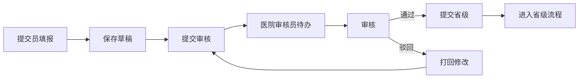

# 申报模块重大需求变更 - 实施方案

## 一、需求理解确认

### 核心变更点


| #   | 需求         | 处理方式                                   |
| --- | ---------- | -------------------------------------- |
| 1   | 医院无备案模块    | 前端硬编码删除备案菜单，后端代码和表保留                   |
| 2   | 医院基本信息不可更改 | 数据层面锁定 hospitalInfo 字段，前端禁用编辑          |
| 3   | 每年4次进度填报   | 新建进度填报表（独立于现有ProjectProcess），国家局配置时间窗口 |
| 4   | 显示上期指标值    | 每个指标显示上期填报值+变化量（颜色区分），保留历史快照           |
| 5   | 医院内部二级审核   | 提交员填报 -> 审核员审核 -> 省级审核 -> 上报国家局        |
| 6   | 批量上报国家局    | 省级工作台入口，跨同省医院多选，省级用户手动上报               |
| 7   | 多维度标签查询    | 新建医院标签系统，支持区域/等级/特征等多维度统计筛选            |


### 关键细节确认

- **时间安排**: 每年两次（上半年、下半年各一次），共4次（两年内）
- **填报内容**: 每次填报全量指标
- **驳回处理**: 省级驳回后医院修改重新提交，**不占用每年4次限额**
- **上期值展示**: 显示上期值 + 变化量（用颜色区分增长/下降）
- **批量上报范围**: 同省跨医院多选批量上报
- **国家局处理**: 上报后只需查看/导出，无需审核
- **不需要表单附表**: 每次填报只有指标数据，无富文本、无附件
- **标签维度**: 区域（华东区等）、等级（三级甲等等）、特征（综合型等）

---

## 二、数据库设计

### 2.0 医院标签系统（多维度查询）

> 用于支持多维度的数据查询统计，如：按华东区筛选、按三级甲等筛选、多维度组合筛选

```sql
-- =============================================
-- 表0-1：医院标签定义表
-- =============================================
CREATE TABLE declare_hospital_tag (
    id              BIGINT PRIMARY KEY AUTO_INCREMENT,
    tag_code        VARCHAR(32)  NOT NULL COMMENT '标签编码（唯一，如 REGION_EAST）',
    tag_name        VARCHAR(64)  NOT NULL COMMENT '标签名称（如 华东区）',
    tag_category    VARCHAR(32)  NOT NULL COMMENT '标签分类：region=区域 level=等级 feature=特征 attribute=属性',
    tag_type        TINYINT      NOT NULL DEFAULT 1 COMMENT '标签类型：1=单选 2=多选',
    parent_id       BIGINT       COMMENT '父标签ID（树形结构用）',
    sort            INT          DEFAULT 0 COMMENT '排序',
    status          TINYINT      DEFAULT 1 COMMENT '状态：0=禁用 1=启用',
    creator         VARCHAR(64),
    create_time     DATETIME     NOT NULL DEFAULT CURRENT_TIMESTAMP,
    updater         VARCHAR(64),
    update_time     DATETIME     NOT NULL DEFAULT CURRENT_TIMESTAMP ON UPDATE CURRENT_TIMESTAMP,
    deleted         BIT          NOT NULL DEFAULT FALSE,

    UNIQUE INDEX idx_tag_code (tag_code),
    INDEX idx_category (tag_category)
) COMMENT '医院标签定义表';

-- =============================================
-- 表0-2：医院标签关联表（多对多）
-- =============================================
CREATE TABLE declare_hospital_tag_relation (
    id              BIGINT PRIMARY KEY AUTO_INCREMENT,
    hospital_code   VARCHAR(64)  NOT NULL COMMENT '医院标识（社会信用代码）',
    tag_id          BIGINT       NOT NULL COMMENT '标签ID',
    creator         VARCHAR(64),
    create_time     DATETIME     NOT NULL DEFAULT CURRENT_TIMESTAMP,

    INDEX idx_hospital (hospital_code),
    INDEX idx_tag (tag_id),
    UNIQUE INDEX uk_hospital_tag (hospital_code, tag_id)
) COMMENT '医院标签关联表';

-- =============================================
-- 预置标签数据
-- =============================================
-- 区域标签（7个）
INSERT INTO declare_hospital_tag (tag_code, tag_name, tag_category, tag_type, sort) VALUES
('REGION_EAST', '华东区', 'region', 1, 1),
('REGION_SOUTH', '华南区', 'region', 1, 2),
('REGION_NORTH', '华北区', 'region', 1, 3),
('REGION_CENTRAL', '华中区', 'region', 1, 4),
('REGION_SOUTHWEST', '西南区', 'region', 1, 5),
('REGION_NORTHWEST', '西北区', 'region', 1, 6),
('REGION_NORTHEAST', '东北区', 'region', 1, 7);

-- 等级标签
INSERT INTO declare_hospital_tag (tag_code, tag_name, tag_category, tag_type, sort) VALUES
('LEVEL_3A', '三级甲等', 'level', 1, 1),
('LEVEL_3B', '三级乙等', 'level', 1, 2),
('LEVEL_2A', '二级甲等', 'level', 1, 3),
('LEVEL_2B', '二级乙等', 'level', 1, 4),
('LEVEL_1', '一级医院', 'level', 1, 5);

-- 特征标签
INSERT INTO declare_hospital_tag (tag_code, tag_name, tag_category, tag_type, sort) VALUES
('FEATURE_COMPREHENSIVE', '综合型', 'feature', 1, 1),
('FEATURE_SPECIALTY', '专科医院', 'feature', 1, 2),
('FEATURE_INTEGRATED', '中西医结合', 'feature', 2, 3),
('FEATURE_TCM', '中医专科', 'feature', 2, 4);
```

### 2.1 进度填报相关表（3张）

```sql
-- =============================================
-- 表1：进度填报主表（只存元信息，不存指标值）
-- 指标值统一存储在 declare_indicator_value 中
-- =============================================
CREATE TABLE declare_progress_report (
    id                              BIGINT PRIMARY KEY AUTO_INCREMENT COMMENT '主键ID',
    report_year                     INT         NOT NULL COMMENT '填报年度',
    report_batch                    INT         NOT NULL COMMENT '填报批次(1-4)',
    hospital_id                     BIGINT      NOT NULL COMMENT '医院ID',
    hospital_name                   VARCHAR(200) COMMENT '医院名称(冗余)',
    province_code                   VARCHAR(20) COMMENT '省份编码',
    province_name                   VARCHAR(100) COMMENT '省份名称',

    -- 填报阶段状态
    report_status                   TINYINT     NOT NULL DEFAULT 0 COMMENT '填报状态: 0-草稿 1-已提交 2-医院审核中 3-医院审核通过 4-医院审核驳回',

    -- 省级审核状态（独立于医院内部状态）
    province_status                 TINYINT     NOT NULL DEFAULT 0 COMMENT '省级审核: 0-未提交 1-省级审核中 2-省级通过 3-省级驳回',
    province_opinion                TEXT COMMENT '省级审核意见',
    province_audit_time             DATETIME COMMENT '省级审核时间',
    province_auditor_id             BIGINT COMMENT '省级审核人ID',
    province_auditor_name           VARCHAR(100) COMMENT '省级审核人姓名',

    -- 国家局上报状态
    national_report_status          TINYINT DEFAULT 0 COMMENT '国家局上报: 0-未上报 1-已上报',
    national_report_time            DATETIME COMMENT '上报时间',
    national_reporter_id            BIGINT COMMENT '上报人ID',
    national_reporter_name          VARCHAR(100) COMMENT '上报人姓名',

    -- 关联的BPM流程实例ID
    hospital_process_instance_id    VARCHAR(64) COMMENT '医院内部审核流程实例ID',
    province_process_instance_id    VARCHAR(64) COMMENT '省级审核流程实例ID',

    -- 提交人信息
    creator                         VARCHAR(64) COMMENT '创建者(提交员)',
    create_time                     DATETIME    NOT NULL DEFAULT CURRENT_TIMESTAMP,
    updater                         VARCHAR(64) COMMENT '更新者',
    update_time                     DATETIME    NOT NULL DEFAULT CURRENT_TIMESTAMP ON UPDATE CURRENT_TIMESTAMP,
    deleted                         BIT         NOT NULL DEFAULT FALSE,
    tenant_id                       BIGINT      NOT NULL DEFAULT 1,

    INDEX idx_hospital_year (hospital_id, report_year),
    INDEX idx_report_status (report_status),
    INDEX idx_province_status (province_status),
    INDEX idx_year_batch (report_year, report_batch),
    INDEX idx_hospital_batch (hospital_id, report_year, report_batch)
) COMMENT '年度进度填报主表';

-- =============================================
-- 表2：国家局上报记录表（记录每次批量上报的操作日志）
-- =============================================
CREATE TABLE declare_national_report_record (
    id                              BIGINT PRIMARY KEY AUTO_INCREMENT,
    report_ids                      LONGTEXT    NOT NULL COMMENT '本次上报的填报记录ID列表(JSON数组)',
    report_count                    INT         NOT NULL COMMENT '上报记录数量',
    province_code                   VARCHAR(20) NOT NULL COMMENT '上报省份编码',
    province_name                   VARCHAR(100) COMMENT '上报省份名称',
    reporter_id                     BIGINT      NOT NULL COMMENT '上报人ID',
    reporter_name                   VARCHAR(100) COMMENT '上报人姓名',
    report_time                     DATETIME    NOT NULL COMMENT '上报时间',
    remark                          TEXT COMMENT '备注',
    create_time                     DATETIME    NOT NULL DEFAULT CURRENT_TIMESTAMP,

    INDEX idx_province (province_code),
    INDEX idx_reporter (reporter_id),
    INDEX idx_report_time (report_time)
) COMMENT '国家局上报记录表';

-- =============================================
-- 表3：填报时间窗口配置表（由国家局配置，开放医院填报时间）
-- =============================================
CREATE TABLE declare_report_window (
    id                              BIGINT PRIMARY KEY AUTO_INCREMENT,
    report_year                     INT          NOT NULL COMMENT '填报年度',
    report_batch                    INT          NOT NULL COMMENT '填报批次(1-4)',
    window_start                    DATETIME     NOT NULL COMMENT '开放开始时间',
    window_end                      DATETIME     NOT NULL COMMENT '开放结束时间',
    remark                          VARCHAR(500) COMMENT '备注说明',
    status                          TINYINT      NOT NULL DEFAULT 1 COMMENT '状态: 0-禁用 1-启用',
    creator                         VARCHAR(64),
    create_time                     DATETIME     NOT NULL DEFAULT CURRENT_TIMESTAMP,
    updater                         VARCHAR(64),
    update_time                     DATETIME     NOT NULL DEFAULT CURRENT_TIMESTAMP ON UPDATE CURRENT_TIMESTAMP,
    deleted                         BIT         NOT NULL DEFAULT FALSE,

    INDEX idx_year_batch_status (report_year, report_batch, status)
) COMMENT '填报时间窗口配置表';
```

### 2.2 指标值表改造（declare_indicator_value）

```sql
-- 在现有 declare_indicator_value 表中增加3个字段
ALTER TABLE declare_indicator_value
    ADD COLUMN hospital_id    BIGINT COMMENT '医院ID（直接关联，避免JOIN）',
    ADD COLUMN report_year    INT    COMMENT '填报年度（用于按年统计）',
    ADD COLUMN report_batch   TINYINT COMMENT '填报批次1-4（用于按期次查询）';

-- 新增索引优化查询性能
ALTER TABLE declare_indicator_value
    ADD INDEX idx_hospital_period (hospital_id, report_year, report_batch);
```

### 2.3 上期值查询逻辑

```sql
-- SQL：获取某医院某指标的上期值
SELECT
    div.*
FROM declare_indicator_value div
INNER JOIN declare_progress_report dpr
    ON div.business_id = dpr.id
    AND div.business_type = 10  -- 进度填报类型
WHERE
    div.hospital_id = #{hospitalId}
    AND div.report_year = #{reportYear}
    AND dpr.report_batch = (
        SELECT MAX(dpr2.report_batch)
        FROM declare_progress_report dpr2
        WHERE dpr2.hospital_id = #{hospitalId}
          AND dpr2.report_year = #{reportYear}
          AND dpr2.report_batch < #{currentBatch}
          AND dpr2.province_status = 2  -- 省级通过
          AND dpr2.deleted = FALSE
    )
    AND dpr.province_status = 2
    AND dpr.deleted = FALSE;
```

---

## 三、后端改造

### 3.0 医院标签系统


| 文件路径                                                 | 说明         |
| ---------------------------------------------------- | ---------- |
| `dal/dataobject/hospital/HospitalTagDO.java`         | 标签定义表      |
| `dal/dataobject/hospital/HospitalTagRelationDO.java` | 标签关联表      |
| `dal/mysql/HospitalTagMapper.java`                   | 标签Mapper   |
| `dal/mysql/HospitalTagRelationMapper.java`           | 关联Mapper   |
| `HospitalTagService.java`/`Impl`                     | 标签管理（CRUD） |
| `HospitalTagRelationService.java`/`Impl`             | 标签关联管理     |
| `HospitalTagQueryService.java`/`Impl`                | 多维度查询服务    |


### 3.1 进度填报相关


| 文件路径                                                         | 说明           |
| ------------------------------------------------------------ | ------------ |
| `dal/dataobject/progress/DeclareProgressReportDO.java`       | 进度填报主表       |
| `dal/dataobject/progress/DeclareNationalReportRecordDO.java` | 国家局上报记录      |
| `dal/dataobject/progress/DeclareReportWindowDO.java`         | 填报时间窗口配置     |
| `dal/mysql/DeclareProgressReportMapper.java`                 | 进度填报主表Mapper |
| `dal/mysql/DeclareNationalReportRecordMapper.java`           | 上报记录Mapper   |
| `dal/mysql/DeclareReportWindowMapper.java`                   | 时间窗口Mapper   |


### 3.2 Service 改造


| 文件                                    | 改造内容                          |
| ------------------------------------- | ----------------------------- |
| `DeclareIndicatorValueServiceImpl`    | 新增 `getLastPeriodValues()` 方法 |
| `DeclareProgressReportService`/`Impl` | 进度填报全流程                       |
| `DeclareNationalReportService`/`Impl` | 批量上报逻辑                        |
| `DeclareReportWindowService`/`Impl`   | 时间窗口配置                        |
| `HospitalTagQueryService`/`Impl`      | 多维度标签查询、跨维度统计                 |


### 3.3 Controller


| 文件                                | 路径                         | 方法            |
| --------------------------------- | -------------------------- | ------------- |
| `HospitalTagController`           | `/declare/hospital-tag`    | 标签CRUD + 关联管理 |
| `DeclareProgressReportController` | `/declare/progress-report` | 填报 CRUD + 审核  |
| `DeclareNationalReportController` | `/declare/national-report` | 批量上报          |
| `DeclareReportWindowController`   | `/declare/report-window`   | 时间窗口配置（国家局）   |


---

## 四、前端改造

### 4.0 医院标签管理后台

```
views/declare/hospital-tag/                    [新建目录]
  index.vue                                    标签列表页
  components/
    TagFormModal.vue                          标签定义弹窗
    HospitalTagAssignModal.vue                  医院标签分配弹窗
    TagStatisticsPanel.vue                    标签统计面板
```

### 4.1 备案模块移除

```
删除以下文件和目录：
- views/declare/filing/              删除整个目录
- api/declare/filing/                删除整个目录
- constants/bpm/business-type.ts      删除 filing 相关常量
- composables/useBpmApproval.ts       移除 filing 相关引用
- 路由配置中移除 /declare/filing      路由
- 菜单配置中移除备案菜单项
```

### 4.2 省级工作台多维度筛选

```vue
<!-- 省级工作台 - 多维度筛选 -->
<template>
  <div class="filter-section">
    <!-- 区域筛选 -->
    <Select v-model="filters.region" placeholder="选择区域" @change="handleFilterChange">
      <Option v-for="tag in regionTags" :key="tag.id" :value="tag.id">
        {{ tag.tagName }}
      </Option>
    </Select>

    <!-- 等级筛选 -->
    <Select v-model="filters.level" placeholder="选择等级" @change="handleFilterChange">
      <Option v-for="tag in levelTags" :key="tag.id" :value="tag.id">
        {{ tag.tagName }}
      </Option>
    </Select>

    <!-- 特征筛选（多选） -->
    <Select v-model="filters.features" multiple placeholder="选择特征" @change="handleFilterChange">
      <Option v-for="tag in featureTags" :key="tag.id" :value="tag.id">
        {{ tag.tagName }}
      </Option>
    </Select>
  </div>
</template>
```

### 4.3 新建页面结构

```
views/declare/
  hospital-tag/                        [新建 - 标签管理]
    index.vue
    components/
      TagFormModal.vue
      HospitalTagAssignModal.vue

  progress-report/                     [新建 - 进度填报]
    index.vue
    components/
      ProgressReportFormModal.vue
      ProgressReportDetail.vue
      IndicatorInputTable.vue
      AuditModal.vue
      ProvinceAuditModal.vue
    modules/
      HistoryDialog.vue

  national-report/                     [新建 - 国家局上报]
    index.vue
    components/
      ReportTable.vue
      BatchReportModal.vue

  report-window/                       [新建 - 时间窗口]
    index.vue
    components/
      WindowFormModal.vue

views/province/                        [新建 - 省级工作台]
  dashboard/
    HospitalReportDashboard.vue
    NationalReportPanel.vue
  components/
    ProvinceAuditTable.vue
```

---

## 五、多维度查询设计

### 5.1 查询接口

```java
// 多维度标签查询服务
public interface HospitalTagQueryService {

    /**
     * 多维度标签查询
     * @param tagIds 标签ID列表（AND条件，多个标签必须同时满足）
     * @param category 标签分类（可选，用于过滤）
     */
    List<HospitalVO> queryByTags(List<Long> tagIds, String category);

    /**
     * 统计各维度医院分布
     * @param category 标签分类（region/level/feature）
     */
    Map<String, Long> statisticsByCategory(String category);

    /**
     * 跨维度统计（如：各区域内各等级医院数量）
     * @param category1 第一维度
     * @param category2 第二维度
     */
    List<DimensionStatVO> crossStatistics(String category1, String category2);

    /**
     * 关联进度填报的多维度统计
     * @param tagIds 标签筛选
     * @param reportYear 年度
     * @param reportBatch 批次
     */
    List<ReportStatVO> statisticsWithReport(List<Long> tagIds, Integer reportYear, Integer reportBatch);
}
```

### 5.2 SQL 查询示例

```sql
-- 查询华东区 + 三级甲等 的所有医院
SELECT DISTINCT h.*
FROM declare_hospital h
INNER JOIN declare_hospital_tag_relation r1 ON h.social_credit_code = r1.hospital_code
INNER JOIN declare_hospital_tag t1 ON r1.tag_id = t1.id AND t1.tag_code = 'REGION_EAST'
INNER JOIN declare_hospital_tag_relation r2 ON h.social_credit_code = r2.hospital_code
INNER JOIN declare_hospital_tag t2 ON r2.tag_id = t2.id AND t2.tag_code = 'LEVEL_3A';

-- 按区域统计医院数量
SELECT t.tag_name AS region, COUNT(DISTINCT r.hospital_code) AS hospital_count
FROM declare_hospital_tag t
LEFT JOIN declare_hospital_tag_relation r ON t.id = r.tag_id
WHERE t.tag_category = 'region'
GROUP BY t.id, t.tag_name
ORDER BY hospital_count DESC;

-- 跨维度统计：各区域内各等级医院数量
SELECT
    r1.tag_name AS region,
    r2.tag_name AS level,
    COUNT(DISTINCT tr.hospital_code) AS count
FROM declare_hospital_tag_relation tr
INNER JOIN declare_hospital_tag r1 ON tr.tag_id = r1.id AND r1.tag_category = 'region'
INNER JOIN declare_hospital_tag_relation tr2 ON tr.hospital_code = tr2.hospital_code
INNER JOIN declare_hospital_tag r2 ON tr2.tag_id = r2.id AND r2.tag_category = 'level'
GROUP BY r1.id, r1.tag_name, r2.id, r2.tag_name;
```

---

## 六、BPM 流程设计

### 6.1 医院内部审核流程 (declare_progress_report_hospital)




### 6.2 省级审核流程 (declare_progress_report_province)


---

## 七、实施优先级与计划

### 第一阶段：核心基础（2-3周）

1. **数据库改造** - 新建3张表 + 标签系统2张表 + declare_indicator_value 增加3个字段
2. **后端核心** - DO、Mapper、基础CRUD Service
3. **BPM流程** - 配置2个独立流程定义

### 第二阶段：标签系统（1周）

1. **医院标签** - 标签管理后台 + 多维度查询服务
2. **标签集成** - 将标签与进度填报统计集成

### 第三阶段：业务功能（2-3周）

1. **进度填报** - 填报表单、上期值展示（含变化量）、历史记录
2. **审核流程** - 医院二级审核、省级审核
3. **指标服务** - 上期值查询逻辑改造

### 第四阶段：上报功能（1-2周）

1. **批量上报** - 国家局上报记录、同省跨医院多选
2. **省级工作台** - Dashboard、多维度筛选、统计面板

### 第五阶段：收尾与配置（1周）

1. **备案移除** - 前端代码删除
2. **时间窗口** - 国家局配置界面
3. **测试与Bug修复**

---

## 八、数据库改动总结


| 操作类型 | 表名                               | 改动内容                                           |
| ---- | -------------------------------- | ---------------------------------------------- |
| 新建   | `declare_hospital_tag`           | 医院标签定义表                                        |
| 新建   | `declare_hospital_tag_relation`  | 医院标签关联表                                        |
| 新建   | `declare_progress_report`        | 进度填报主表                                         |
| 新建   | `declare_national_report_record` | 国家局上报记录                                        |
| 新建   | `declare_report_window`          | 填报时间窗口配置                                       |
| 修改   | `declare_indicator_value`        | 增加 hospital_id, report_year, report_batch 三个字段 |


---

## 九、方案优势


| 对比项        | 方案A（复用indicator_value） | 方案B（新建独立指标表）  |
| ---------- | ---------------------- | ------------- |
| 数据库改动      | 小（新增3个字段）              | 大（新建表 + 迁移数据） |
| 与现有指标系统兼容性 | 高（完全复用）                | 低（需要维护两套）     |
| 开发工作量      | 中                      | 大             |
| 数据一致性      | 需要业务层维护                | 独立表更清晰        |


